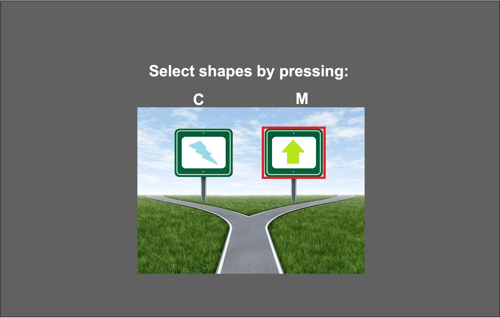
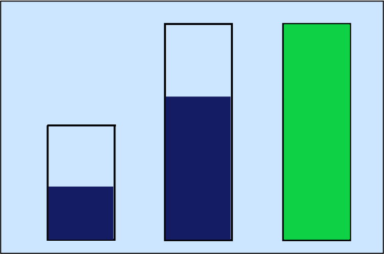

<body style="background-color:e4e4e4;"></body>

  
 

<iframe src="https://reading.onlinesurveys.ac.uk/contact_survey1" width="620" height="500"></iframe>

This page contains information about the TASK study being conducted by the NRG lab, University of Reading.  

### This is a study being conducted by the [NRG-Lab](https://www.nrg-lab.co.uk/) by the following researchers: 
Prof. Ciara McCabe (<a href="mailto:c.mccabe@reading.ac.uk">c.mccabe@reading.ac.uk</a>) 

Angad Sahni, PhD Student (<a href="mailto:a.sahni@pgr.reading.ac.uk">a.sahni@pgr.reading.ac.uk</a>) 
 
 

### You can view the [instructions](README.md#instructions) with images from the task.  This will give you an idea of what it entails.

 
 

  
<b>John contributed to scientific research. John is a superhero now. Be John.</b> 

 
 

# Take Part!
 
You will need a <b>laptop or PC</b> to participate.
 
 

  
 

 
 

# Instructions

### Your Aim
We want you to <b>MAXIMIZE reward</b> and <b>MINIMIZE effort</b> over the whole task.  
One side is <b>better than the other</b> and we want you to figure out which one it is!

 

<!--(https://c.tenor.com/1chQnZduRjkAAAAM/chuck-norris-approved.gif)  Chuck, thumbs up
 
(https://c.tenor.com/fa890AzlMTkAAAAd/party-hard-raise-hands.gif) Office, party gif -->

 
<h3 align="center"><b>Choose a shape</b>   </h3>
 
 

<h3 align="center"><b>The outcome is an image (reward) and the effort it requires</b>   </h3>
 
 

<h3 align="center"><b>Exert effort by pressing C and M in alternation (CMCMCM...) and fill up the bar</b>   </h3>
 
 

<h3 align="center"><b>Achieve reward! It's obvious which one is more rewarding...</b>   </h3>
 
 

<h3 align="center" style="color:red"><b>REPEAT!</b></h3>
 
 
 
 
 
 
 
 

<button onclick="topFunction()" id="myBtn" title="Go to top"><b>Top</b></button>

